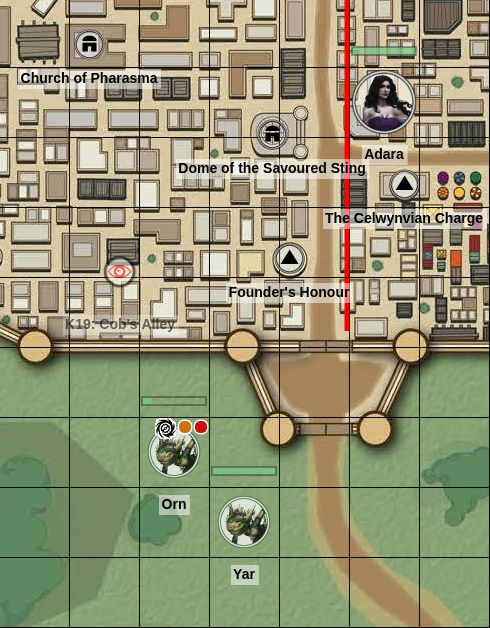
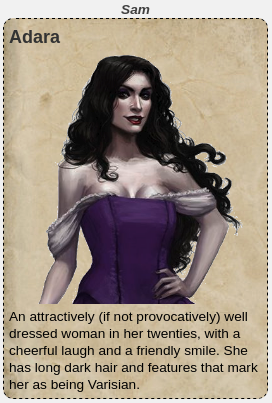
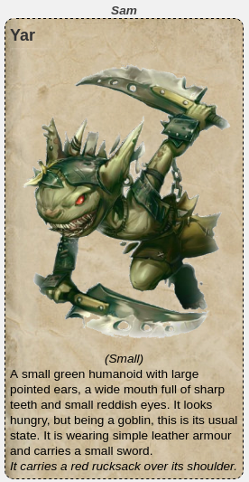
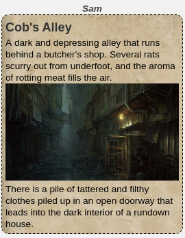

PfDescribe
==========

Displays textual information in the chat window, allowing the GM and players
to quickly view descriptions of things without having to mess around in the
journal or open dialogs. It makes use of **PfInfo** to display condition and
status information about tokens within their description.

Commands
--------

**!pfdescribe** tokenId - Describe a token, outputting information to the
chat window. If run by the GM the information is broadcast to everyone,
otherwise it is whispered to the player.

It is recommended to create a couple of macros for this. The first is 
```GM-Describe``` and is for use by the GM: 

````
!pfdescribe @{selected|token_id}
````

The second would be ```Describe``` and made visible to all players, allowing
them to get a physical description of tokens on the map:

````
!pfdescribe @{target|token_id}
````

Since most tokens won't be editable by players, using the target notation
is the only way they will be able to select the token to describe it.

Advanced
--------

**PfDescribe** works slightly differently depending on the type of token
that is selected, and each has different use cases.

**Character Tokens**

If the token represents a character, then this is the default case. The
avatar of the character will be displayed (if available), along with the
contents of the character's *bio* field up until a -- delimiter. If there
is a -- (double hyphen) on a line by itself, then nothing after this will
be displayed in the output of !pfdescribe.

The *gmnotes* field of the token will also be searched for any lines
delimited by ~~ characters. These will be appended to the end of the text
description.

e.g. putting "~~ This orc is covered in sores. ~~" in the *tokens* gmnotes
field will append that to the normal description of the orc *character*.
This allows individual tokens to have customised descriptions.

Finally, status effects (as per !pfinfo) will be displayed if the token
has any status markers associated with them.

**Points of Interest**

If a token has no character associated with it, then a handout with the
same name as the token will be looked for. If it is found, then the avatar
of the handout, and its player text, will be output.

This is designed for when tokens on the map represent points of interest.
Players (and the GM) can select them and view information about the
location.

**Room Descriptions**

If a token has no character, and also has no matching handout, then it
is assumed to be a room description. The contents of the *gmnotes* field
of the token will be displayed, up to a -- delimiter.

Such descriptions may contain a handout name in chevrons, e.g.: << handout >>
If a matching handout is found, then the avatar of the handout will be
displayed as an inline image.

Examples
--------

The following examples give a view of what the output of the API command
looks like. We start with a simple map of a city, which has some points
of interest and a few character tokens on it:



Selecting token for the noble lady **Adara**, her avatar image and bio
description is output to chat. Her character name (*Callous Lady*) is
not displayed, player's just see the name on her token.



The two goblins have extra information displayed about them. The first
goblin (*Orn*) is both *heavily wounded* and *dazzled*, so this information
is displayed under his description. The second goblin (*Yar*) happens to
be carrying a red rucksack, which is appended to his description. This
information is held in the token's gmnotes field.

It also displays that both goblins are *Small* creatures. The size of a
creature is displayed if they aren't Medium sized.

 

!pfdescribe also handles tokens that aren't characters. Selecting
*The Celwynvian Charge* point of interest on the map outputs text
taken from the Handout of the same name. If that had an image
associated with it, then this would have been shown as well.


Finally, a non-character token that doesn't have a matching handout is
the token *K19: Cob's Alley*. This is designed for putting room 
descriptions on a map, which may have room numbers associated with them.
Anything before the colon (:) is actually stripped out of the title
before being displayed, and then the text from the *gmnotes* field
of the token is shown.

 

Since the notes text references a named handout within chevrons, the
image from that note is inserted inline into the text output.